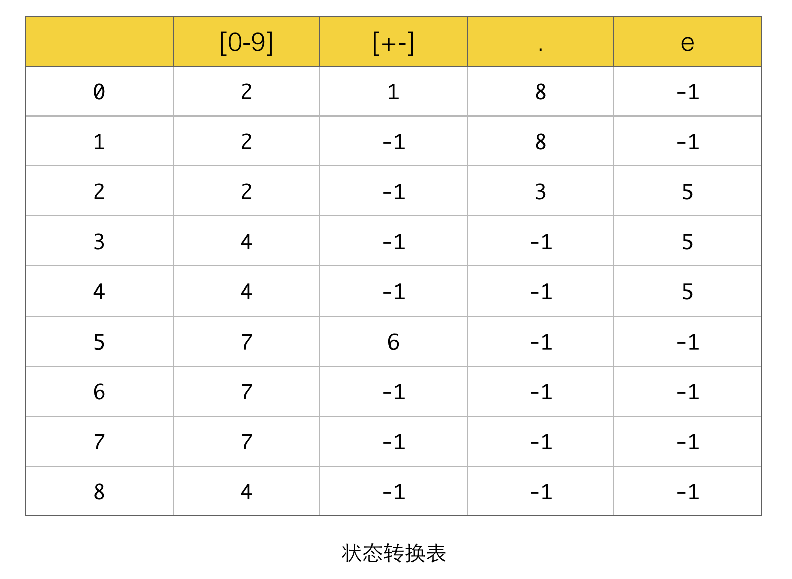
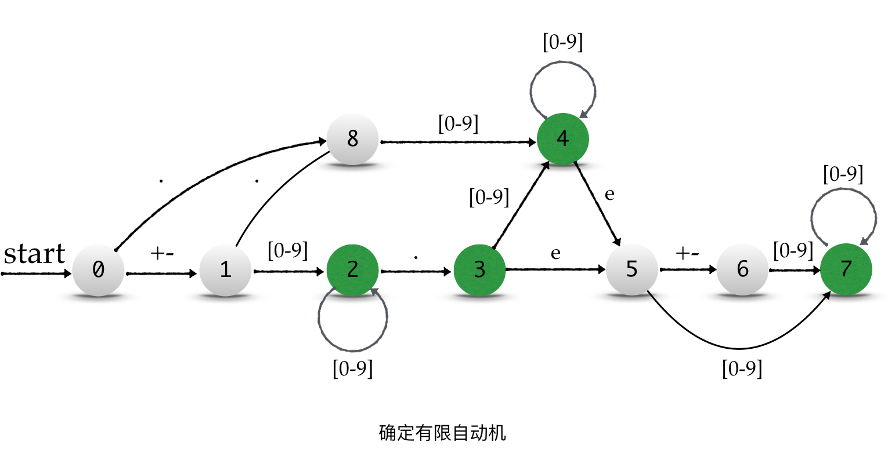
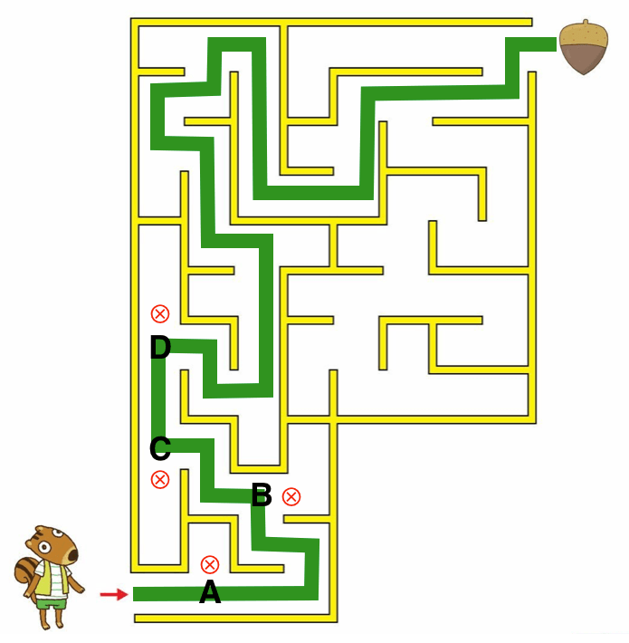
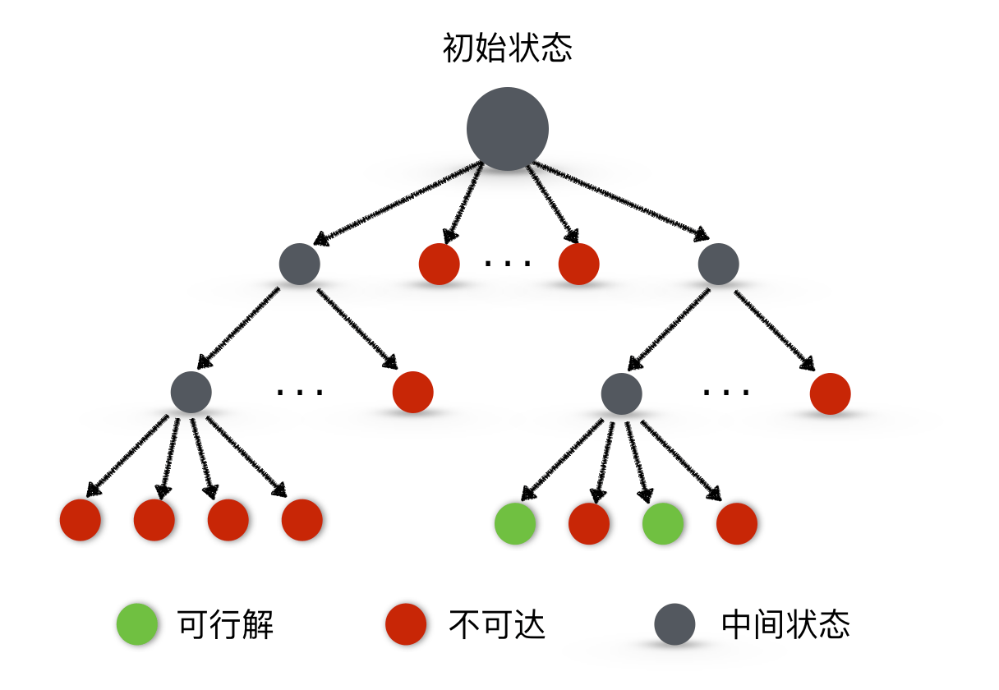
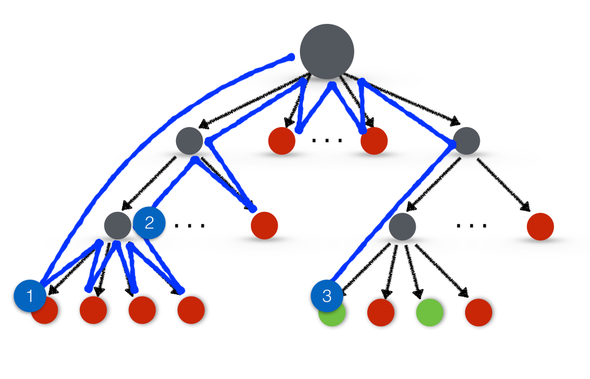
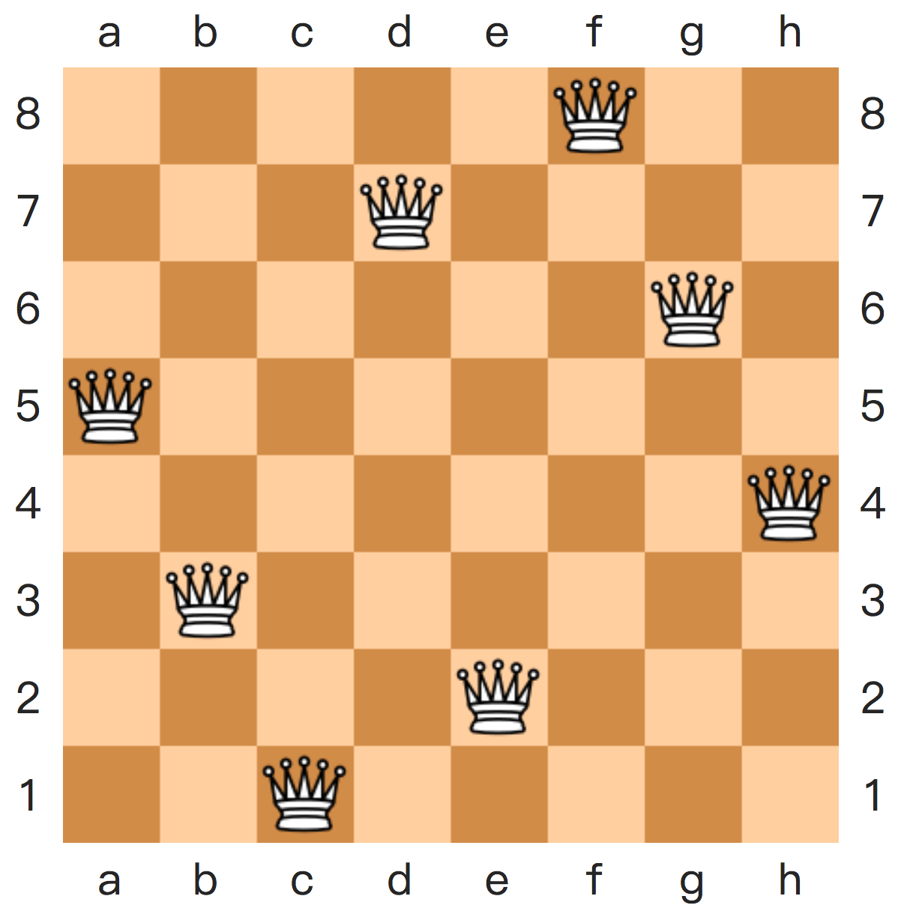
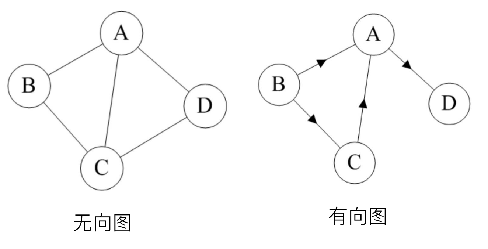

Images - Easy
=======================================

`Github <https://github.com/newsteinking/leetcode>`_ | https://github.com/newsteinking/leetcode

223. Retangle Area
--------------------

.. code-block:: python

    Find the total area covered by two rectilinear rectangles in a 2D plane.
    Each rectangle is defined by its bottom left corner and top right corner as shown in the figure.

    Assume that the total area is never beyond the maximum possible value of int.

    Credits:Special thanks to @mithmatt for adding this problem, creating the above image and all test cases.

    =================================================================
    class Solution(object):
      def computeArea(self, A, B, C, D, E, F, G, H):
        """
        :type A: int
        :type B: int
        :type C: int
        :type D: int
        :type E: int
        :type F: int
        :type G: int
        :type H: int
        :rtype: int
        """
        area = (C - A) * (D - B) + (G - E) * (H - F)
        overlap = max(min(C, G) - max(A, E), 0) * max(min(D, H) - max(B, F), 0)
        return area - overlap

    =================================================================

65. Valid Number
--------------------

.. code-block:: python

    Validate if a given string is numeric.

    Some examples:
    "0" => true
    "   0.1  " => true
    "abc" => false
    "1 a" => false
    "2e10" => true

    Note: It is intended for the problem statement to be ambiguous. You should gather all requirements up front before implementing one.

    Update (2015-02-10):
    The signature of the C++ function had been updated. If you still see your function signature accepts a const char * argument, please click the reload button  to reset your code definition.

    =================================================================
    class States(object):
      def __init__(self):
        self.init = 0
        self.decimal = 1
        self.decpoint = 2
        self.afterdp = 3
        self.e = 4
        self.aftere = 5
        self.sign = 6
        self.nullpoint = 7
        self.esign = 8
        self.afteresign = 9

    class Solution(object):
      def isNumber(self, s):
        """
        :type s: str
        :rtype: bool
        """
        s = s.strip()
        states = States()
        state = states.init
        decimals = "01234567890"

        for c in s:
          if state == states.init:
            if c == ".":
              state = states.nullpoint
            elif c in decimals:
              state = states.decimal
            elif c in ["+", "-"]:
              state = states.sign
            else:
              return False
          elif state == states.sign:
            if c in decimals:
              state = states.decimal
            elif c == ".":
              state = states.nullpoint
            else:
              return False
          elif state == states.esign:
            if c not in decimals:
              return False
            state = states.afteresign
          elif state == states.afteresign:
            if c not in decimals:
              return False
          elif state == states.nullpoint:
            if c not in decimals:
              return False
            state = states.decpoint
          elif state == states.decimal:
            if c in decimals:
              continue
            elif c == "e":
              state = states.e
            elif c == ".":
              state = states.decpoint
            else:
              return False
          elif state == states.decpoint:
            if c in decimals:
              state = states.afterdp
            elif c == "e":
              state = states.e
            else:
              return False
          elif state == states.afterdp:
            if c in decimals:
              continue
            elif c == "e":
              state = states.e
            else:
              return False
          elif state == states.e:
            if c in decimals:
              state = states.aftere
            elif c in ["+", "-"]:
              state = states.esign
            else:
              return False
          elif state == states.aftere:
            if c not in decimals:
              return False
          else:
            return False
        return state not in [states.init, states.e, states.nullpoint, states.sign, states.esign]

    =================================================================

223
---------------

.. image:: ./img/chapter15/223_rectange_area.png

65 State Convert
-------------------

65 Valid Number
-------------------

Backtracking 1
----------------

Backtracking 2
----------------

Backtracking 3
----------------

Backtracking 4
----------------

Graph 1
----------------

Stack Demo
----------------

.. image:: ./img/chapter15/stack_demo.png

Tree 1
----------------

.. image:: ./img/chapter15/Tree_1.jpg

Tree 2
----------------

.. image:: ./img/chapter15/Tree_2.jpg